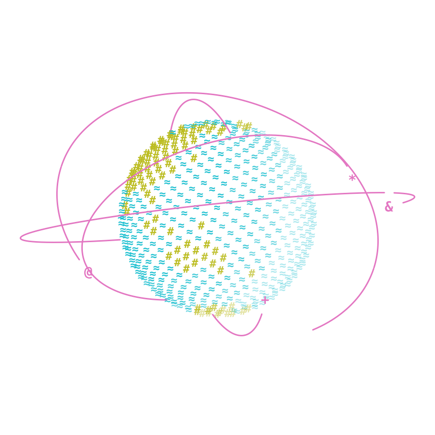
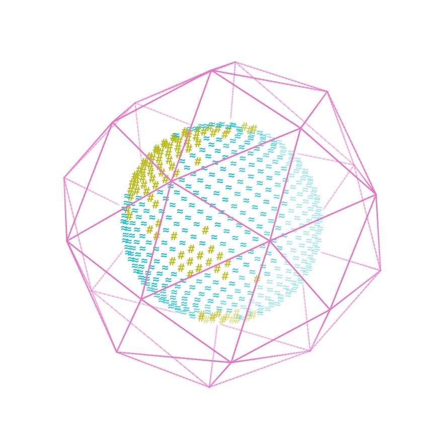
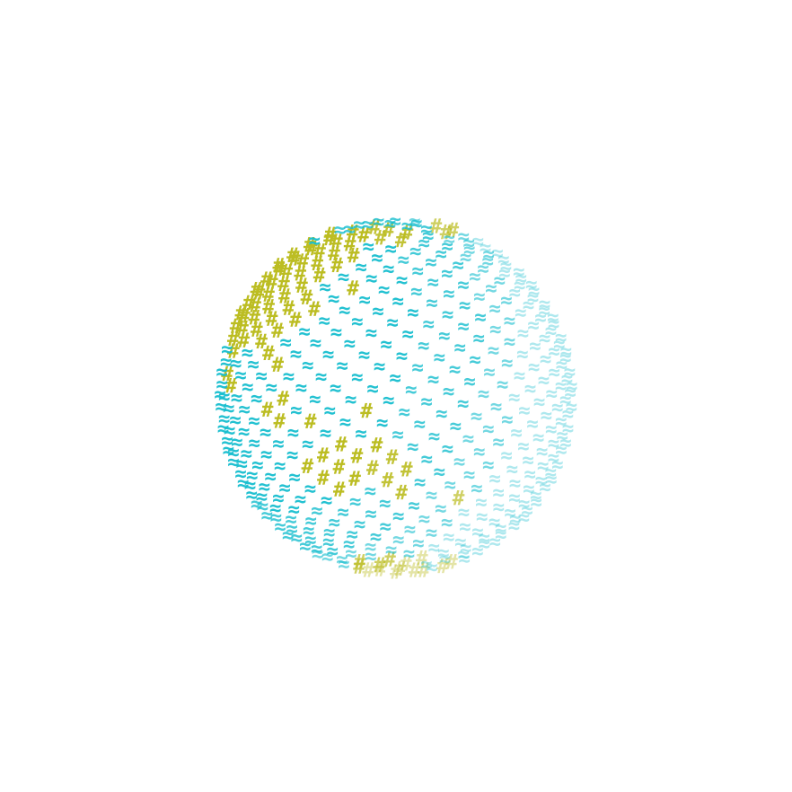
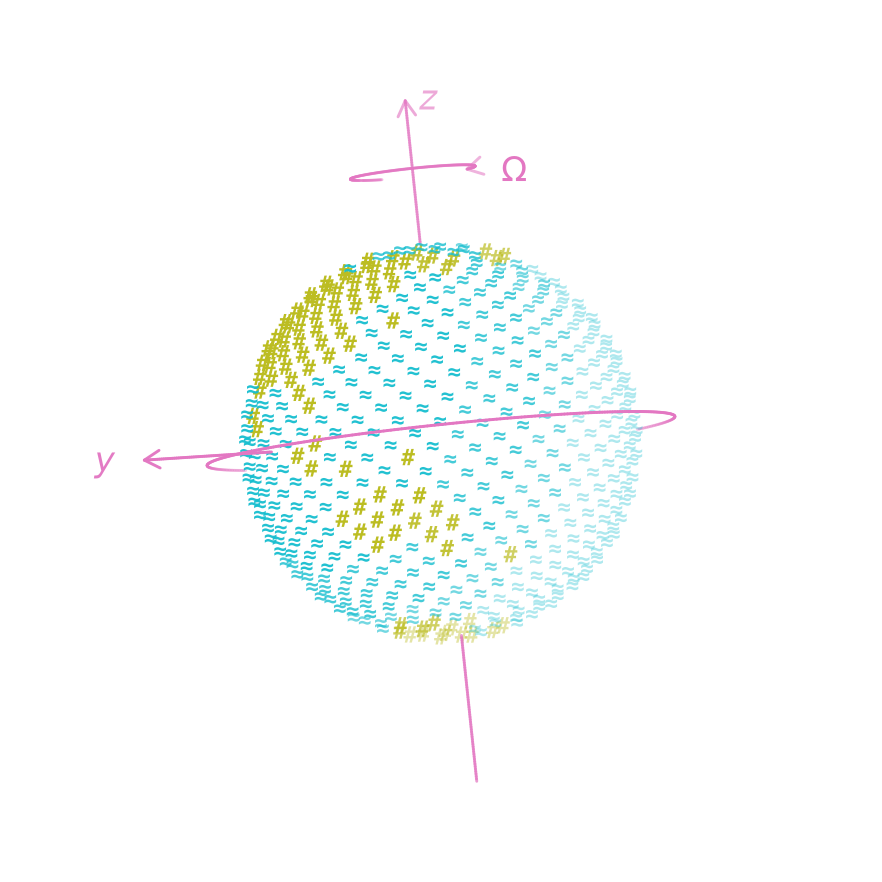
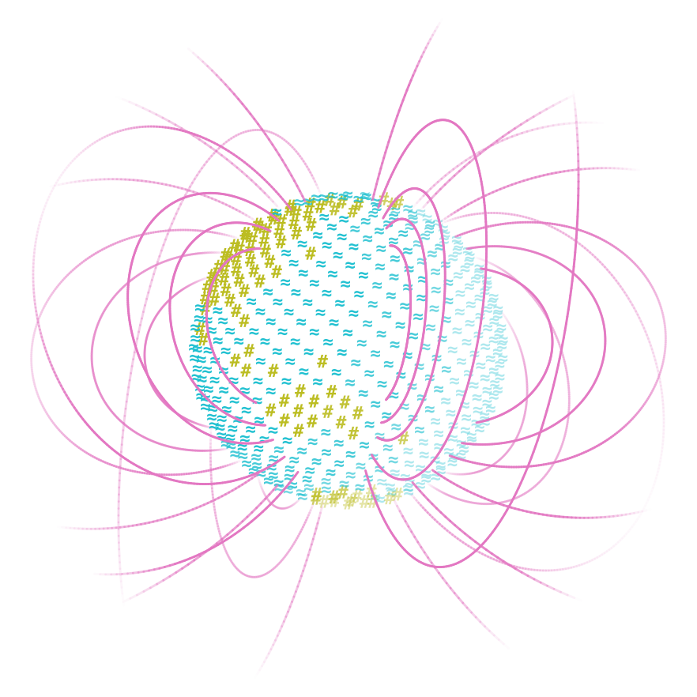

#  

## Contexte

Le réseau thématique Numérique en Terre Solide (NuTS) fédère celles et ceux qui développent et utilisent des outils numériques en Terre solide, de l'analyse de données au calcul intensif, pour rendre cette communauté plus visible, mieux informée et plus efficace.

[En savoir plus →](apropos.md#contexte)

## Objectifs

Diffuser les bonnes pratiques du numérique, faire connaître les codes de la communauté, relayer les possibilités de financement et partager les outils à notre disposition.

[En savoir plus →](apropos.md#objectifs)

## Rencontres

Chaque année, une rencontre plénière mêle présentations scientifiques et travaux pratiques (git, HPC, IA, Python…), complétée par des formations et des journées thématiques.

[En savoir plus →](workshops/index.md)

## Pilotage

Le réseau est ouvert à tous les personnels de l'INSU concernés par le numérique en Terre solide. Un comité de pilotage le coordonne et se réunit chaque mois.

[En savoir plus →](apropos.md#pilotage)

## Contacts et listes de diffusion

- Tous les membres (liste modérée) : [gdr-nuts@services.cnrs.fr](mailto:gdr-nuts@services.cnrs.fr)
- Comité de pilotage : [cp-gdr-nuts@services.cnrs.fr](mailto:cp-gdr-nuts@services.cnrs.fr)
- S'inscrire : [listes.services.cnrs.fr](https://listes.services.cnrs.fr/wws/subscribe/gdr-nuts)

[En savoir plus →](contact.md)

