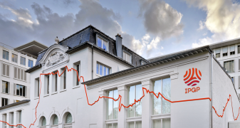

# École d'été IA 2025

## Présentation

Deux demi-journées avec des orateurs invités, l'une sur les défis scientifiques de la Terre solide, l'autre sur les avancées méthodologiques en IA, pour susciter de nouvelles collaborations entre les deux communautés.

## Lieu

Grand amphithéâtre de l'[Institut de physique du globe de Paris](https://maps.app.goo.gl/wyzPFxmgNDpzTZp3A), 1 rue Jussieu, 75005 Paris.

## Présentations

| Intervenant | Affiliation | Titre | Support |
|-------------|-------------|-------|---------|
| Quentin Bletery |  | AI-driven earthquake and tsunami early warning | - |
| Charles Le Losq |  | From lava to eruptions: How AI can help advance volcanological research | - |
| Jannes Münchmeyer |  | What can deep learning earthquake catalogs actually tell us? | - |
| Catherine Pothier |  | Unsupervised data mining technique to extract patterns corresponding to aseismic SLOW slip events: application to the Izmit section of the north Anatolian fault | - |
| Antoine Lucas |  | Can AI be leveraged to revisit unsolved problems in critical zone research? | - |
| Giuseppe Costantino |  | Signal extraction from noisy geospatial data: detecting transient deformations through spatiotemporal deep learning | - |
| Joachim Rimpot |  | Self-Supervised learning for the exploration of large seismological datasets | - |
| Andrea Tomasi |  | Towards the prediction of elastic (seismic) anisotropy in the upper mantle using supervised deep-learning | - |
| Christophe Rigotti |  | Bridging local and global explanations of tree ensemble predictions using co-clustering of SHAP values | - |
| Sylvain Lobry |  | Foundation models for remote sensing: which one(s)? | - |
| Erwan Allys |  | Unsupervised modeling and separation of seismic signals with scattering transforms | - |
| Stéphanie Allassonnière |  | Taking advantage of geometry in Variational Autoencoders for data representation and augmentation | - |
