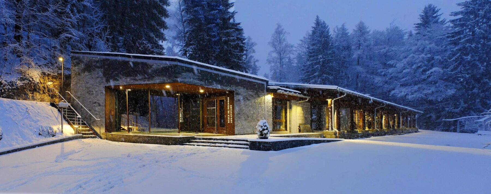
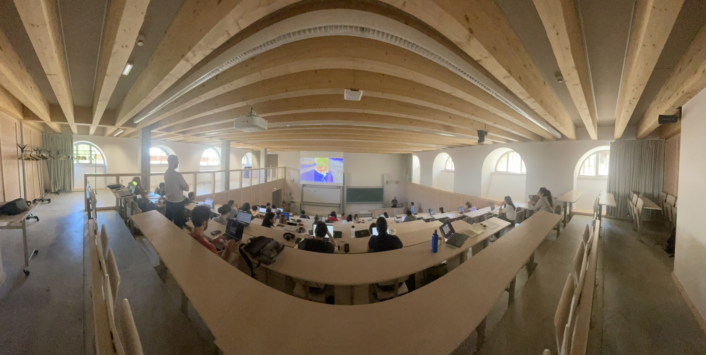
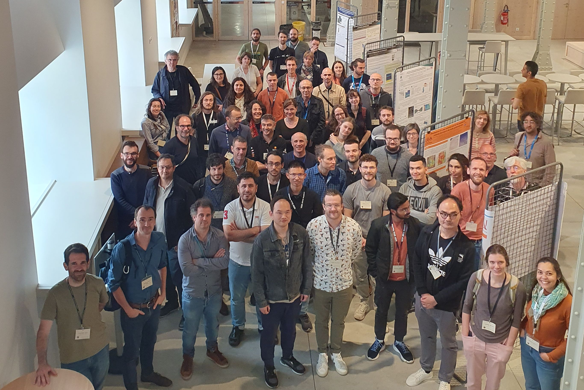
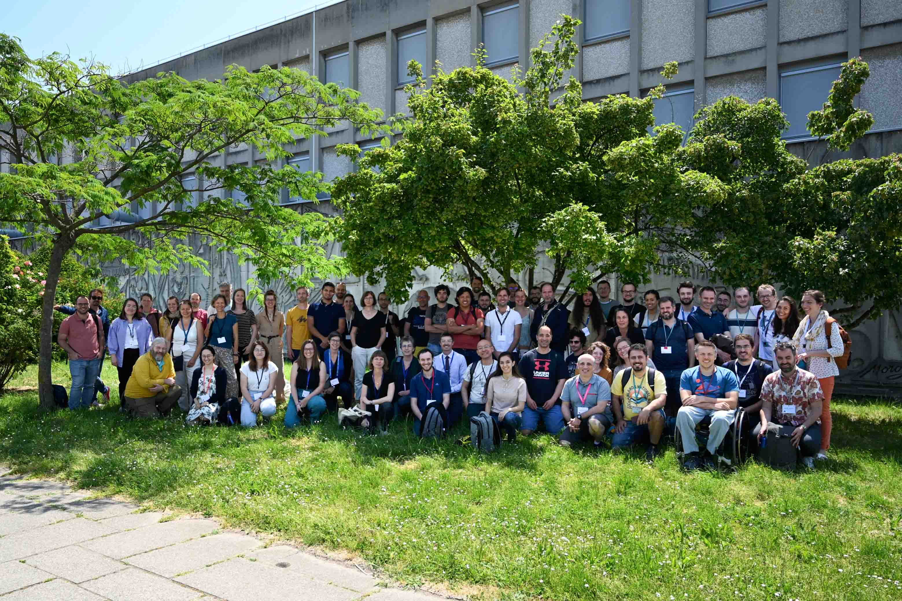
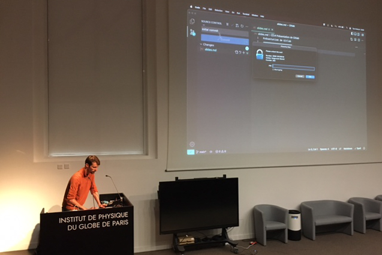

# Rencontres

Une rencontre plénière par an (présentations et travaux pratiques), des formations centrées sur un outil, et des journées thématiques. Toutes sont ouvertes aux personnels INSU-TS et au-delà.

## Calendrier

- `2027` Nantes · mai

    **[5ème rencontre plénière](workshop-2027.md)**

    Modélisation multi-échelle. À venir.

    

- `2027` Les Houches · janvier

    **[Journées thématiques GAIA](gaia-2027.md)**

    Intelligence artificielle en géosciences. À venir.

    

- `2026` Strasbourg · mai

    **[4ème rencontre plénière](workshop-2026.md)**

    Assimilation de données.

    

- `2025` Paris · juillet

    **[Journées thématiques IA](ia-ts-2025.md)**

    Intelligence artificielle en Terre solide.

    

- `2025` Grenoble · mai

    **[3ème rencontre plénière](workshop-2025.md)**

    Données et infrastructures.

    

- `2025` Nantes · avril

    **[Formation SPECFEM](specfem-2025.md)**

    Éléments spectraux avec SPECFEM.

    

- `2024` Strasbourg · mai

    **[2ème rencontre plénière](workshop-2024.md)**

    Problèmes inverses.

    

- `2023` Lyon · mai

    **[1ère rencontre plénière](workshop-2023.md)**

    Apprentissage machine.

    

- `2022` Paris · octobre

    **[Rencontre de lancement](kickoff-2022.md)**

    Présentation du réseau et de ses orientations.

    
