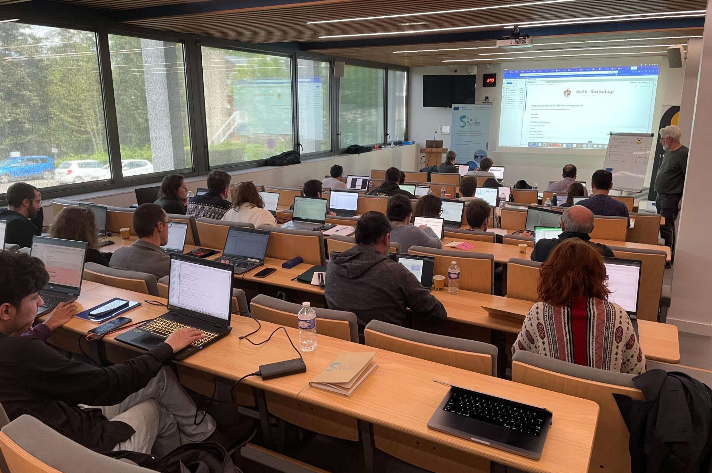

# Formation SPECFEM

Formation à la méthode des éléments spectraux avec le code SPECFEM, dans le cadre du projet européen [ChEESE-2P](https://cheese2.eu/).

## Présentations

| Intervenant | Affiliation | Titre | Support |
|-------------|-------------|-------|---------|
| *À venir* | | | |
