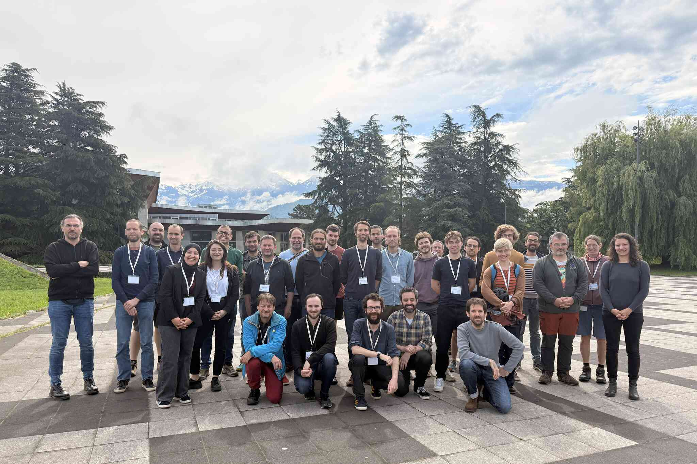

# 3ème rencontre plénière

## Présentation

Les données : gestion, workflows, stockage, analyse et visualisation. Deux jours de présentations, puis deux jours de travaux pratiques sur la machine Phileas (MesoNET, mésocentre GLiCID), et une session posters.

## Lieu

Auditorium de l'IMAG, 150 place du Torrent, 38400 Saint-Martin-d'Hères.

## Présentations

| Intervenant | Affiliation | Titre | Support |
|-------------|-------------|-------|---------|
| Y. Capdeville | LPG | Introduction | [PDF](https://gitlab.univ-nantes.fr/nuts/workshops/-/raw/main/2025-05-19/poster-pitches/01_Capdeville.pdf) |
| A. Fournier | IPGP | INRIA quadrant program | [PDF](https://gitlab.univ-nantes.fr/nuts/workshops/-/raw/main/2025-05-19/day_1/02_Fournier.pdf) |
| B. Fabrèges | UCBL | The "Groupe Calcul" and its activities | [PDF](https://gitlab.univ-nantes.fr/nuts/workshops/-/raw/main/2025-05-19/day_1/03_Fabreges) |
| C. N. Herrera Contreras | CEA | An overview of workflow numerical tools | - |
| G. Levavasseur | IPSL, Sorbonne Université | Conférence plénière (données du GIEC) | - |
| T. Chauve | IGE, UGA | Fiber optic: a new tool to investigate glacier dynamics at IGE | - |
| A. Trabattoni | Géoazur, UCA, OCA | Développement de la bibliothèque Python xdas (DAS) | - |
| M. Mouchené | UGA | Déploiement traitement DAS sur grille | - |
| R. Blanch & F. Thollard | LJK, ISTerre, UGA | Représentation et visualisation de données complexes | - |
| M. Boichu | LOA, CNRS, Université de Lille | VOLCPLUME, une plateforme web interactive pour le suivi multi-échelles des panaches volcaniques et de leur impact sur l'atmosphère | - |
| D. Schuster | UGA, SEISCOPE | Workflow manager for full waveform inversion | - |
| Y. Dupont | GLiCID, Nantes Université | Les dessous affriolants du stockage de données, un panorama technologique et logique | - |
| M. Massol | INRAE | Long-term preservation in trustworthy repositories: issues, opportunities, risks, organisational and technical solutions, costs | - |
| J. Tierny | Sorbonne Université | An Introduction to Topological Data Analysis with the Topology ToolKit | - |

## Posters

- Kevin Juhel (LPGP), *Operational tsunami warning based on graph deep learning and prompt elastogravity signals (PEGS)*
- Matthieu Nougaret (IPGP), *Leveraging multivariate geophysical and geochemical time series for monitoring volcanic systems: can we use machine learning?*
- Feryal Talbi (LIP6, Sorbonne Université), *Towards Automatic and Explainable Seismic Interpretation: Merging Knowledge Graphs and Machine Learning*

## Formations et tutoriels

| Intervenant | Affiliation | Titre | Support |
|-------------|-------------|-------|---------|
| Julien Tierny | Sorbonne Université | Analyse topologique de données avec la Topology ToolKit | - |
| Léonard Seydoux | IPGP | Programmer avec l'IA générative | - |
| David Waroquiers | Matgenix | Introduction to high-throughput simulations and automated workflows | - |
| Joachim Rimpot | Université de Strasbourg | Self-supervised learning pour l'exploration de grands jeux de données | - |
