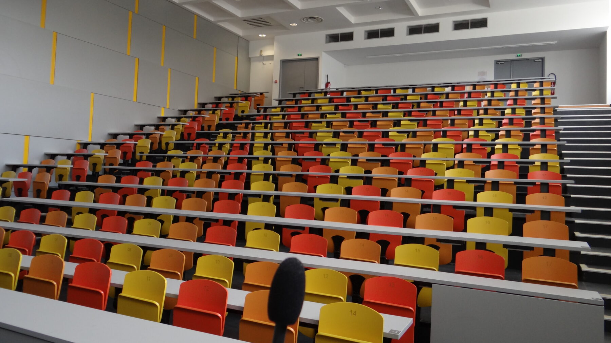

# 5ème rencontre plénière

<small>Amphithéâtre B, faculté des sciences de Nantes Université ([Anne Jea.](https://commons.wikimedia.org/wiki/File:Amphi_B_-_Facult%C3%A9_des_Sciences_de_l%27universit%C3%A9_de_Nantes_2.jpg), CC BY-SA 4.0)</small>

## Présentation

La cinquième rencontre plénière du réseau sera consacrée à la modélisation multi-échelle. Le programme sera annoncé prochainement sur la [liste de diffusion](../contact.md#sabonner).

## Lieu

Nantes.
